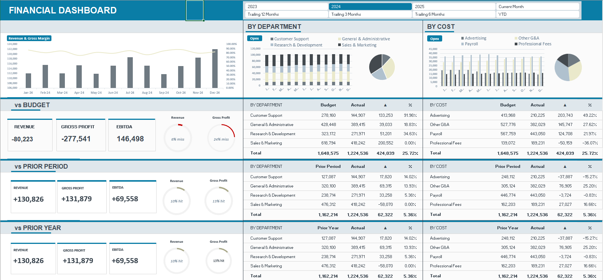

# Business Expense Tracking & Budget Variance Dashboard

A comprehensive Financial Analytics Dashboard built in Microsoft Excel, featuring dynamic charts, interactive slicers, and department-level budget tracking with variance analysis.

---

## Overview

This dashboard enables finance teams and business managers to monitor actual spending against budgets, compare performance across time periods, and identify cost variances by department and cost type — all within a single, interactive Excel workbook.

---

## Workbook Structure

| Sheet | Description |
|-------|-------------|
| `Dashboard` | Main interactive view with charts, KPIs, and slicers |
| `Data` | Consolidated data model powering all dashboard visuals |
| `List` | Reference lists used for slicer and dropdown controls |
| `G&A` | Actual expenses — General & Administrative department |
| `R&D` | Actual expenses — Research & Development department |
| `CS` | Actual expenses — Customer Support department |
| `S&M` | Actual expenses — Sales & Marketing department |
| `G&A_Budget` | Budget figures for General & Administrative |
| `R&D_Budget` | Budget figures for Research & Development |
| `CS_Budget` | Budget figures for Customer Support |
| `S&M_Budget` | Budget figures for Sales & Marketing |

---

## How the Dashboard Works

### 1. Data Entry

Actual and budget financial data are entered in the department-specific sheets (e.g., `G&A`, `R&D`, `CS`, `S&M` and their `_Budget` counterparts). Each row represents a transaction or monthly summary with fields such as:

- **Date** – Transaction or period date
- **Account** – Expense category (e.g., *Salary & Wages*, *Software & Apps*, *Travel*)
- **Summary Grouping** – High-level category grouping (e.g., *Payroll Expenses*, *Office Expenses*)
- **Amount** – Dollar value of the expense or budget line

### 2. The Data Sheet

The `Data` sheet aggregates all department entries into a unified table. This is the single source of truth consumed by Excel PivotTables and charts on the Dashboard.

### 3. Interactive Dashboard Controls

The `Dashboard` sheet provides the following interactive controls via **slicers**:

| Slicer | Options |
|--------|---------|
| **Section** | Expenses, Revenue & Gross Margin |
| **Departments** | All, Customer Support, G&A, R&D, S&M |
| **Period** | Current Month, YTD, Trailing 3 / 6 / 12 Months, Custom range |
| **Versions** | Budget, Prior Period, Prior Year |

Selecting different slicer values instantly updates all charts and KPI tiles on the dashboard.

### 4. Key Metrics Displayed

#### Revenue & Gross Margin
- **Revenue** – Total income for the selected period
- **Gross Profit** – Revenue minus Cost of Goods Sold (COGS)
- **EBITDA** – Earnings before interest, taxes, depreciation, and amortization

#### Budget Variance Analysis (BvA)
| Metric | Description |
|--------|-------------|
| **Var to Budget ($)** | Actual spend minus budgeted amount in dollars |
| **Var to Budget (%)** | Percentage deviation from budget |

#### Actual vs Prior Period (AvPP)
| Metric | Description |
|--------|-------------|
| **Var to Prior Period ($)** | Dollar change compared to the previous period |
| **Var to Prior Period (%)** | Percentage change compared to the previous period |

#### Actual vs Prior Year (AvPY)
| Metric | Description |
|--------|-------------|
| **Var to Prior Year ($)** | Dollar change compared to the same period last year |
| **Var to Prior Year (%)** | Percentage change year-over-year |

---

## Examples

### Example 1 — Reviewing January 2024 Payroll Budget Variance

**Scenario:** You want to know whether the G&A department was over or under budget on payroll in January 2024.

**Steps:**
1. Open `Business Expense Tracking & Budget Variance Dashboard.xlsx`.
2. Go to the **Dashboard** sheet.
3. In the **Departments** slicer, select **G&A**.
4. In the **Period** slicer, select **Current Month** (ensure Jan-24 is the loaded month in the data).
5. In the **Section** slicer, select **Expenses**.
6. Look at the **BvA: Opex By Dept** chart and the **Var to Budget ($)** KPI tile.

**Interpretation:**
- A **negative** variance (shown in red, `▲ (-)`) means actual payroll exceeded the budget — overspent.
- A **positive** variance (shown in green, `▲ (+)`) means actual payroll was below budget — underspent.

---

### Example 2 — Comparing Year-to-Date Expenses Across Departments

**Scenario:** Management wants to compare YTD actual spending by department against budget for the full year 2024.

**Steps:**
1. Go to the **Dashboard** sheet.
2. In the **Period** slicer, select **YTD**.
3. Leave **Departments** set to **All**.
4. In the **Section** slicer, select **Expenses**.
5. Review the **BvA: Opex By Dept** bar chart.

**What to look for:**
- Each department's bar shows actual spend vs budget side-by-side.
- Departments with bars extending beyond the budget line are over budget.
- Hover over chart elements to see exact values.

---

### Example 3 — Identifying the Largest Cost Overruns by Cost Type

**Scenario:** The CFO wants to know which cost categories are driving the biggest overruns across the company.

**Steps:**
1. Go to the **Dashboard** sheet.
2. Set **Departments** to **All**.
3. Set **Period** to **YTD** or **Trailing 12 Months**.
4. Review the **BvA: Opex By Cost Type** chart.

**Common cost categories tracked:**
- Payroll Expenses (Salary & Wages, Payroll Taxes, Health Insurance, Commissions)
- Professional Services (Accounting, Consulting, Legal, Recruiting Fees)
- Office Expenses (Software & Apps, Rent & Lease, Utilities, Office Supplies)
- Travel, Meals & Entertainment
- Advertising & Marketing
- Bank Charges & Fees

---

### Example 4 — Year-over-Year Revenue Growth

**Scenario:** You want to track whether revenue has grown compared to the same period last year.

**Steps:**
1. Go to the **Dashboard** sheet.
2. In the **Section** slicer, select **Revenue & Gross Margin**.
3. In the **Versions** slicer, select **Prior Year**.
4. In the **Period** slicer, select **Current Month** or **YTD**.
5. Review the **AvPY: Rev, GP, EBITDA** section.

**Interpretation:**
- **Var to Prior Year (%)** shows the growth rate.
- Positive percentage = revenue increased year-over-year.
- Negative percentage = revenue declined year-over-year.

---

## Supported Time Periods

| Period | Definition |
|--------|-----------|
| Current Month | The most recent calendar month in the data |
| YTD | Year-to-date from January of the current year to the current month |
| Trailing 3 Months | The last 3 calendar months |
| Trailing 6 Months | The last 6 calendar months |
| Trailing 12 Months | The last 12 calendar months (rolling year) |

---

## Tracked Expense Categories

| Category | Sub-categories |
|----------|---------------|
| **Payroll Expenses** | Salary & Wages, Payroll Taxes, Health Insurance, Payroll Processing Fees, Commissions |
| **Office Expenses** | Software & Apps, Insurance, Office Supplies, Rent & Lease, Utilities |
| **Professional Services** | Accounting Fees, Consulting Fees, Legal Fees, Recruiting Fees |
| **Travel, Meals & Entertainment** | Lodging, Meals & Entertainment, Travel |
| **Advertising & Marketing** | Advertising, Conferences & Events |
| **Other G&A** | Bank Charges & Fees, Merchant Account Fees, Web Domain & Hosting Fees, Taxes & Licenses |

---

## Requirements

- Microsoft Excel 2016 or later (for full slicer and PivotTable support)
- Macros do **not** need to be enabled — the dashboard uses native Excel features only

---

## License

This project is licensed under the terms of the [LICENSE](LICENSE) file.
